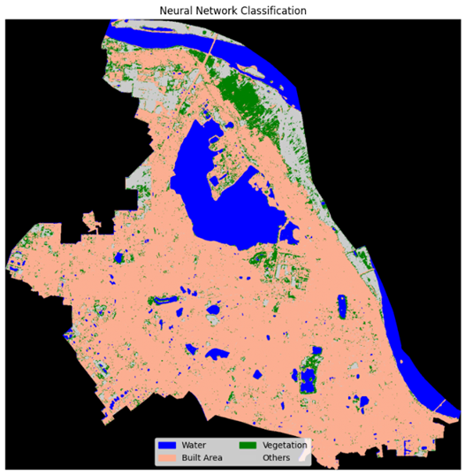
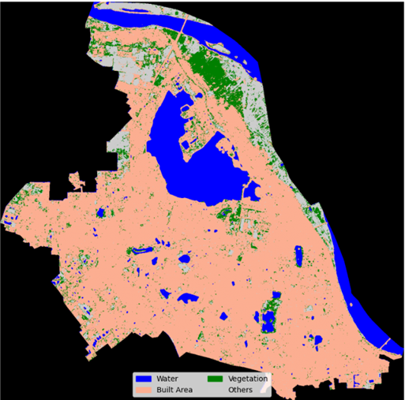
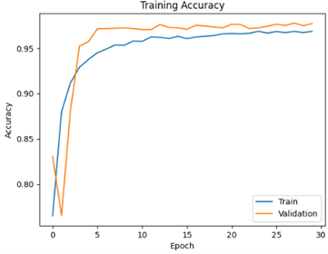

# Sentinel-2 Land Cover Classification - Hanoi, Vietnam


A pixel-based land cover classification project using Sentinel-2 satellite imagery to map urban areas in central Hanoi. Three machine learning models were compared: SVM, Random Forest, and 1D CNN.

## 🎯 Quick Results



| Model | Accuracy | Performance |
|-------|----------|-------------|
| **1D CNN** | **95.26%** | ⭐ **Best** |
| Random Forest | 91.75% | ✅ Good |
| SVM | 89.84% | ✅ Good |

**Winner: 1D CNN** - Best at handling complex urban land covers

## 🗺️ What We Classified



- **Water** 💧 - Lakes, rivers
- **Built Area** 🏢 - Buildings, roads  
- **Vegetation** 🌳 - Parks, trees
- **Others** 🔶 - Bare land, construction sites

## 📊 Detailed Results

### Model Performance by Class


| Class | SVM | Random Forest | **1D CNN** |
|-------|-----|---------------|-------------|
| Water | 0.99 | 0.98 | **0.99** |
| Built Area | 0.94 | 0.95 | **0.98** |
| Vegetation | 0.59 | 0.63 | **0.77** |
| Others | 0.76 | 0.75 | **0.88** |

### Key Findings
- **CNN excels at mixed/complex areas** 🧠
- **All models good for water detection** 💧
- **Vegetation vs bare land remains challenging** 🌱

### Confusion Matrices

<!-- INSERT: Figure 3.9 - CNN Confusion Matrix -->


<!-- INSERT: Figure 3.10 - Training Accuracy -->


## 🚀 Applications

- **Urban Planning** - Monitor city growth
- **Environmental Tracking** - Watch green space changes  
- **Smart City** - Support data-driven decisions
- **Disaster Management** - Risk assessment and planning

## 💻 Tech Stack

- **Data**: Sentinel-2 satellite imagery (Feb 2020)
- **Area**: Central Hanoi (6 districts)
- **Tools**: Python, TensorFlow, Scikit-learn, QGIS
- **Best Model**: 1D Convolutional Neural Network

## 📁 Repository Structure

```
├── assets/                   
└── Notebooks/                     
    ├── rf_svm.ipynb
    └── CNN.ipynb
```

---

## 📖 Want More Details?

**This README shows the key results.** For complete methodology, technical details, literature review, and full analysis, please read the full project report: `Project2_Report.docx`

The report includes:
- Detailed methodology for each model
- Complete literature review
- Step-by-step data preprocessing
- In-depth analysis and discussion
- Future work suggestions
- Full references

---

**Student**: Vu Duc Thang - Hanoi University of Science and Technology  
**Supervisor**: PhD Tran Nguyen Ngoc